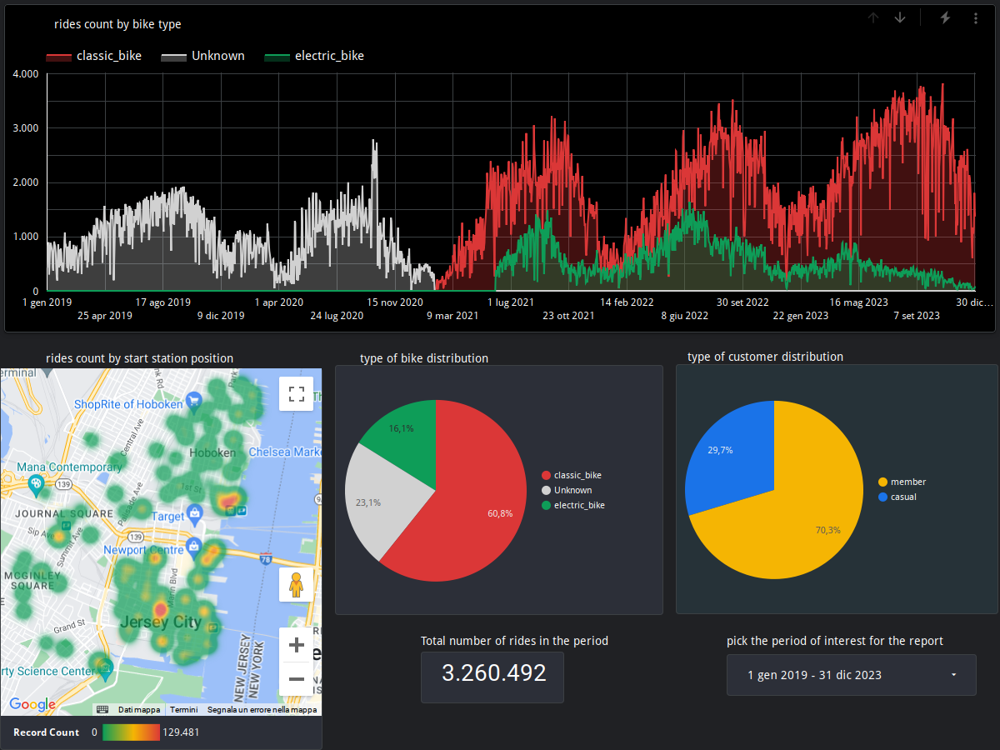

# nyc-bike-analytics

This is my capstone project for [Data Talks Club Data-Engineering-zoomcamp 2024](https://github.com/DataTalksClub/data-engineering-zoomcamp)

### Problem description

- **The objective**
  - The goal is to make an analysis of the bike-sharing system in the city of Jersey City in the United States, extracting insights from a [publicly available historical dataset](https://s3.amazonaws.com/tripdata/index.html). The bike-share service is [operated by Citibike](https://citibikenyc.com/nj), the same operator of the nearby located NYC bike-share system.
- **The dataset**
  - The dataset is composed of compressed csv files (one for each month of the year) of bike rides. In this project we consider the rides archived from 2019 to 2023. Each file is a table, whose rows are single rides described by features like start and end time, start and end station, type of user, type of bike,..
  - main characteristics of the whole dataset (5 years span):

    approximately 3.300.000 rows, 13 columns

    there has been a relevant data schema change from febraury 2021 onward. As a consequence, part of the data processing has been devoted to harmonize the source tables for a unified analysis. Here below is a comparison of the columns before and after the schema change; on the left is  the schema before february 2021;

    | starttime               | started_at         |
    | :------------------------ | -------------------- |
    | stoptime                | ended_at           |
    | usertype (*)            | member_casual      |
    | start station latitude  | start_lat          |
    | end station latitude    | end_lat            |
    | start station longitude | start_lng          |
    | end station longitude   | end_lng            |
    | tripduration            |                    |
    | bikeid                  |                    |
    | birth year              |                    |
    | gender                  |                    |
    |                         | ride_id            |
    |                         | rideable_type      |
    | start station id (**)   | start_station_id   |
    | end station id (**)     | end_station_id     |
    | start station name      | start_station_name |
    | end station name        | end_station_name   |

    (*) (Subscriber → member, Customer → casual)

    (**) (INT to STR)
- **The project architecture**
  - In order to better organize the workflow a data pipeline has been defined, that is depicted in the following figure (more details on the blocks in the following sections)

    
- **Technologies involved**
  - Docker, Terraform, Mage AI, Google Cloud Platform (Google Cloud Storage, Google BigQuery, Looker Studio), Data Build Tool (DBT)

    - In particular, Mage AI is an orchestration tool that eases the construction of the pipeline and the management of its automation. Here below are the blocks defining the DAG of the data pipeline, built inside Mage AI

      
- **Cloud**
  - With the adoption of Terraform, a IaC tool, it is possible to have all the cloud resources under control; they are programmatically easily created and, when done with the project, easily deleted (reducing the risk of undesired costs)
- **Data ingestion**
  - The processing of the data is of *batch type*, being an analysis of historical data. An end-to-end pipeline has been built with the aid of Mage AI to bring the data from the web source to the BI tool (Looker Studio) for the analysis. The DAG includes an intermediate storage step in a Google Cloud Storage bucket (local_to_gcs block), that serves as data lake, where data from different sources could be stored (as an example, some meteorogical data could be added for enriching the analysis).
- **Data warehouse**
  - BigQuery is the data warehouse for the project. A BQ dataset has been created, where data from the data lake has been read by means of BQ external tables. Then the external tables (one for each year of the analysis) have been unioned in an optimized way in a materialized view (stg_JC_citibike_trips). The optimization has been realized by partitioning the data over the column start_at (a timestamp column containing the start time of each ride) with granularity of day. Then a clusterization has been done over start_station_name (a column of categorical type, with high cardinality). Both the partition and the clusterization choices have been done in consideration of the type of transformations that will follow.
- **Transformations**
  - Transformations over the data warehouse staging table has been done by means of DBT core, available as an integration in Mage AI. The final result is the facts_JC_citibike materialized view to which Looker studio is successively connected to make the data analysis.
  - See here below the lineage graph from the dbt documentation of the project (sources and models distinguished by different colors).

* **Dashboard**

  * To build a final report of the insights, a Looker studio Dashboard has been created, connected to the facts_JC_citibike table and containing 4 tiles:

    - *rides count by bike type*: a temporal distribution over the 5-years period
    - *rides count by start station position*: a spatial distibution (heatmap) over the geographic locations of all the start stations in Jersey City
    - *type of bike distribution*: a pie chart showing the percentage of bike types
    - *type of customer distribution*: a pie chart showing the percentage of customer types (member/casual)

*Insights from the graphs above:*

Regarding the rides count by bike type, all the unknowns counts are distributed temporally in a consistent way with the schema change reported before. Before febrauary 2021, the two types (classic and e-bike) were counted together and probably e-bikes were a small fraction, being in an early adoption phase. The registration of e-bikes starts from 1st of June 2021, that is also the date from which the two bike-share systems of Jersey City and Hoboken were unified under the control of Citibike (that already operated the nearby NYC bike sharing). Notice the seasonal effect in the timeline with peaks of utilization in Summer every year, as expected for this type of transportation. As for the heatmap interpretation, two blobs are recognizable corresponding to Hoboken and Jersey City respectively. The hottest points (most popular starting stations in terms of rides count) are in Jersey City Downtown at the Grove St PATH station (that is next to a PATH Station), Hamilton Park (a leisure place) and Hoboken PATH station.

The interactive version of this report is available [here](https://lookerstudio.google.com/reporting/f5c76d75-2615-41a9-a6bb-cd2b80918131)

* **Reproducibility**
* The details to reproduce the project are described [here](docs/project_setup.md)
