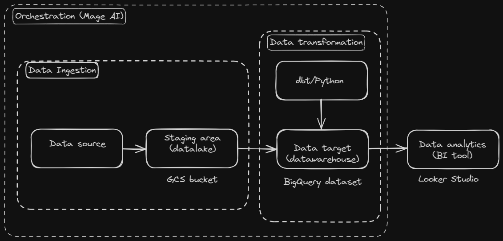

# nyc-bike-analytics

capstone project for [Data Talks Club Data-Engineering-zoomcamp 2024](https://github.com/DataTalksClub/data-engineering-zoomcamp)

Problem description

- The objective
  - The goal is to make an analysis of the bike-sharing system in the city of Jersey City in the United States. The goal is to extract insights from a publicly available historical dataset.
- The dataset
  - The dataset is composed of compressed csv files (one for each month of the year) of bike rides archived from 2019 to 2023. Each file is a table, whose rows are single rides described by features like start and end time, start and end station, type of user, type of bike,..
- The project architecture
  - In order to better organize the workflow a data pipeline is defined, that is depicted in the following figure (more details on the blocks in the following sections)

    
- Technologies involved
  - Mage AI as pipeline orchestrator, Google Cloud Platform (Google Cloud Storage bucket adopted as Datalake, Google BigQuery data warehouse, Looker Studio as BI tool for data analytics), Data Build Tool (DBT) to make SQL transformations on the tables in the DWH)
  - Mage AI is an orchestration tool that eases the construction of the pipeline and the management of the automation. Here below the blocks defining the DAG of the data pipeline, built inside Mage AI

    

Cloud

Data ingestion

Data warehouse

Transformations

Dashboard

Reproducibility
