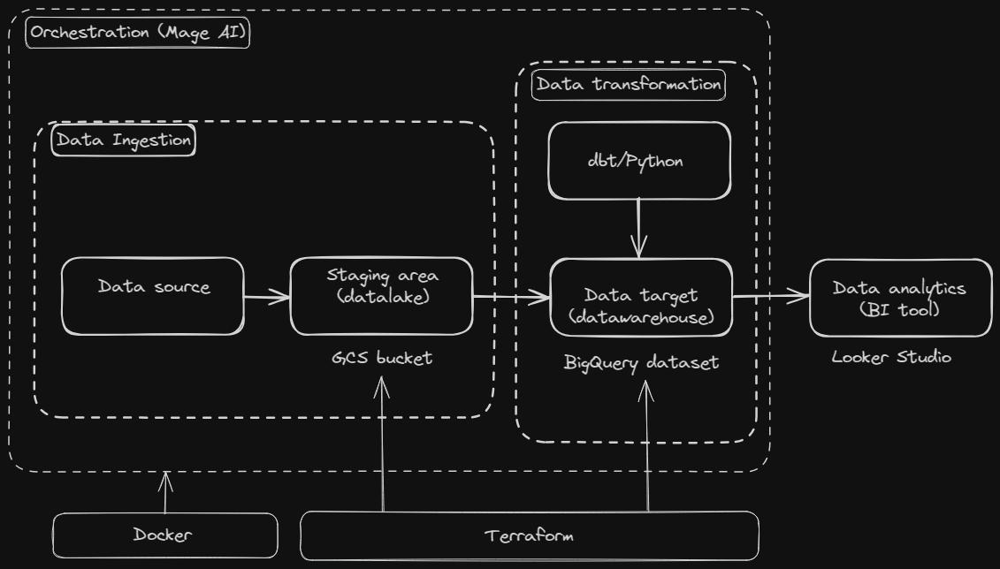
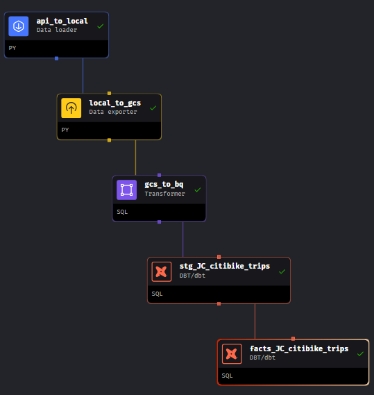
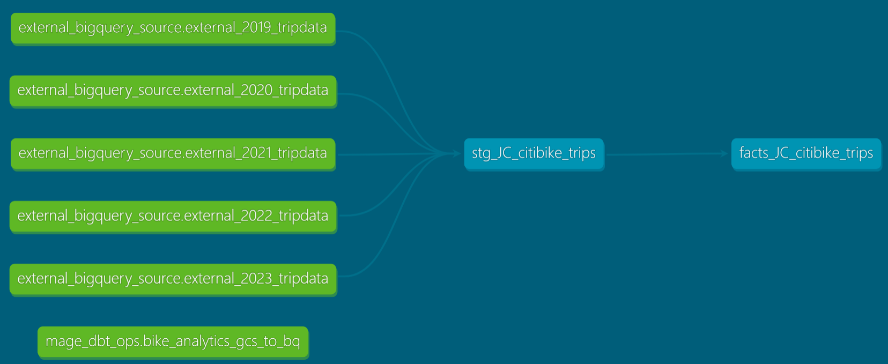
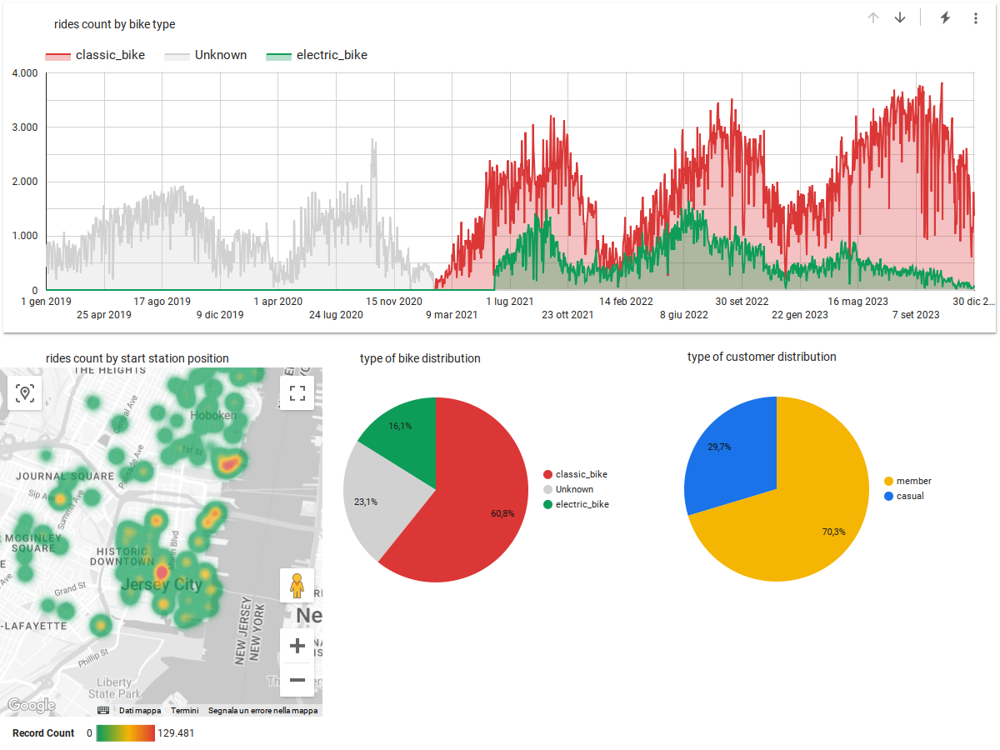

# nyc-bike-analytics

This is my capstone project for [Data Talks Club Data-Engineering-zoomcamp 2024](https://github.com/DataTalksClub/data-engineering-zoomcamp)

### Problem description

- **The objective**
  - The goal is to make an analysis of the bike-sharing system in the city of Jersey City in the United States. The goal is to extract insights from a publicly available historical dataset.
- **The dataset**
  - The dataset is composed of compressed csv files (one for each month of the year) of bike rides archived from 2019 to 2023. Each file is a table, whose rows are single rides described by features like start and end time, start and end station, type of user, type of bike,..

    main characteristics of the whole dataset (5 years span):

    approximately 3.500.000 rows, 13 columns

    a relevant data schema change from febraury 2021 onward (comparison here below, on the left the schema before february 2021)

    | starttime                     | started_at         |
    | :------------------------------ | -------------------- |
    | stoptime                      | ended_at           |
    | usertype (*)                  | member_casual      |
    | start station latitude        | start_lat          |
    | end station latitude          | end_lat            |
    | start station longitude       | start_lng          |
    | end station longitude         | end_lng            |
    | tripduration                  |                    |
    | bikeid                        |                    |
    | birth year                    |                    |
    | gender                        |                    |
    |                               | ride_id            |
    |                               | rideable_type      |
    | start station id (INT to STR) | start_station_id   |
    | end station id (INT to STR)   | end_station_id     |
    | start station name            | start_station_name |
    | end station name              | end_station_name   |

    (*) (Subscriber → member, Customer → casual)
- **The project architecture**
  - In order to better organize the workflow a data pipeline has been defined, that is depicted in the following figure (more details on the blocks in the following sections)

    
- **Technologies involved**
  - Mage AI, Google Cloud Platform (Google Cloud Storage, Google BigQuery, Looker Studio), Data Build Tool (DBT)

    - In particular, Mage AI is an orchestration tool that eases the construction of the pipeline and the management of the automation. Here below are the blocks defining the DAG of the data pipeline, built inside Mage AI

      

Cloud

Data ingestion

Being an analysis of historical data, the processing of the data is of batch type. An end-to-end pipeline has been built with the aid of Mage AI (see figure above) to bring the data from the web source to the BI tool (Looker Studio) for the analysis. The DAG includes an intermediate storage step in a Google Cloud Storage bucket (local_to_gcs block), that serves as data lake, where data from different sources could be stored (as an example, some meteorogical data could be added for enriching the analysis).

Data warehouse

BigQuery serves as the data warehouse for the project. A dataset is created, where data from the data lake is read by means of external tables. Then the external tables (one for each year of the analysis) are unioned in an optimized way in a materialized view (stg_JC_citibike_trips). The optimization is realized by partitioning the data over start_at (a timestamp column containing the start time of each ride) with granularity of day. Then a clusterization has been done over start_station_name (a column of categorical type, with high cardinality). Both the partition and the clusterization choices have been done in consideration of the type of transformations that will follow.

Transformations

Transformations over the data warehouse staging table has been done by means of DBT core. DBT is also available as an integration in Mage AI. The final result is the facts_JC_citibike materialized view to which Looker studio is successively connected to make the data analysis.

See here below the lineage graph from the dbt documentation of the project. Notice that the dbt source mage_dbt_ops_bike_analytics_gcs_to_bq is an external source, created with a SQL transformer block of Mage. Here 'external source' means that the SQL transformation operates on input data that are outside the data warehouse. The output of this block are the BigQuery external tables over which the DBT transformation blocks operate.

Dashboard

To build a final report of the insights, a Looker studio Dashboard has been created, connected to the facts_JC_citibike table and containing 4 tiles:

* rides count by bike type: a temporal distribution over the 5-years period
* rides count by start station position: a spatial distibution (heatmap) over the geographic locations of all the start stations in Jersey City
* type of bike distribution: a pie chart showing the percentage of bike types
* type of customer distribution: a pie chart showing the percentage of customer types (member/casual)

Some insights from the graphs above:

The interactive version of this report is available [here](https://lookerstudio.google.com/reporting/f5c76d75-2615-41a9-a6bb-cd2b80918131)

Reproducibility
